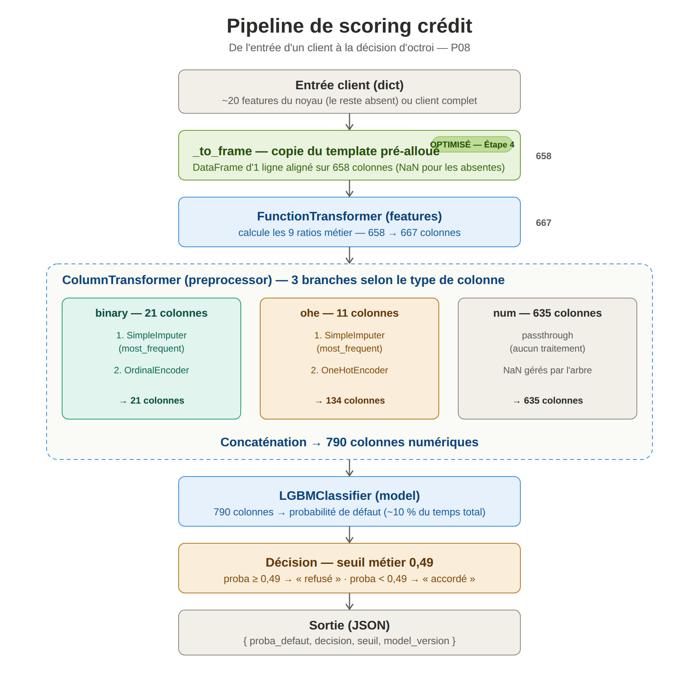

# P08 — Déployez et monitorez votre modèle de scoring

Mise en production du modèle de scoring crédit développé lors du
[Projet 06 — Initiez-vous au MLOps](https://github.com/saidmo/p06_mlops_1_mlflow)
(LightGBM optimisé avec Optuna, AUC-ROC ~0.79, suivi MLflow).

Le contexte métier — fictif — est celui de **Prêt à Dépenser**, dont le
département *Crédit Express* doit traiter en quasi temps réel des
demandes de crédit à la consommation.

## Objectifs de ce dépôt

1. Exposer le modèle via une **API REST** (FastAPI) — ✅ Étape 2.
2. **Conteneuriser** l'application avec Docker — ✅ Étape 2.
3. Automatiser tests et build via **CI/CD** GitHub Actions — ✅ Étape 2.
4. **Journaliser** chaque prédiction (inputs, output, latence) via un
   **logging structuré JSON** et **détecter le data drift** avec
   Evidently, visualisé dans un dashboard **Streamlit** — ✅ Étape 3.
5. **Optimiser** les performances post-déploiement (profiling +
   stratégies testées) — ✅ Étape 4.
6. **Déployer dans le cloud** l'API et le dashboard (Hugging Face Spaces),
   avec déploiement continu depuis GitHub — ✅.

## Structure du dépôt

```
.
├── app/                    code de l'API FastAPI
│   ├── main.py             endpoints, middleware de latence, logging JSON
│   ├── model.py            chargement unique du modèle + scoring
│   └── schemas.py          validation Pydantic (entrée / sortie)
├── model/
│   └── model_credit_scoring.pkl   artefact UNIQUE réutilisé du P06
├── features.py             feature engineering partagé train/serving
├── tests/                  tests unitaires pytest (TestClient)
├── monitoring/             dashboard Streamlit + Evidently + logs JSON (Étape 3)
├── optimization/           profiling, benchmark, rapport et schéma (Étape 4)
├── deploy/                 contenu dédié aux Spaces Hugging Face + assemble.py
│   ├── hf-api/             Dockerfile + README (metadata HF) du Space API
│   ├── hf-dashboard/       Dockerfile + README + requirements du Space dashboard
│   └── assemble.py         prépare le contenu à pousser vers chaque Space
├── logs/
│   └── predictions.jsonl   journal des prédictions (généré au runtime)
├── .github/workflows/      pipeline CI/CD (test → build → deploy)
├── Dockerfile
├── pytest.ini
├── requirements.txt        dépendances runtime de l'API
└── requirements-dev.txt    dépendances de test / monitoring
```

## Artefact modèle

`model/model_credit_scoring.pkl` est un dictionnaire pickle contenant :

- un **`Pipeline` scikit-learn auto-portant** chaînant le calcul des
  ratios métier, l'imputation et l'encodage des variables, puis le
  classifieur LightGBM ;
- les listes de colonnes (`input_cols`, `binary_cols`, `multi_cols`,
  `num_cols`) ;
- le **seuil métier optimal** (0.49) issu de l'optimisation coût
  FN×10 / FP×1 du P06 ;
- l'AUC-ROC de référence et la version du modèle.

## Installation

Prérequis : Python 3.12 (ou 3.11+), et Git.

```bash
# Cloner le dépôt puis, à la racine :
python -m venv .venv

# Activer l'environnement
source .venv/Scripts/activate      # Windows (Git Bash)
# source .venv/bin/activate        # Linux / macOS

# Dépendances : runtime seul, ou dev/test/monitoring
pip install -r requirements.txt        # pour lancer l'API
pip install -r requirements-dev.txt    # pour tests + monitoring
```

> Les versions de la pile numérique (`numpy`, `scipy`, `pandas`,
> `scikit-learn`, `lightgbm`) sont épinglées dans `requirements.txt` pour
> garantir des prédictions identiques entre postes et image Docker, et la
> compatibilité du pickle du modèle.

> **OpenMP (requis par LightGBM) selon la plateforme :**
> - **Windows** : rien à installer, OpenMP est embarqué avec le paquet
>   LightGBM ;
> - **Linux / Docker** : le paquet `libgomp1` (installé dans l'image) ;
> - **macOS** : `libomp`, à installer via Homebrew — `brew install libomp` —
>   sans quoi l'import de LightGBM échoue (`Library not loaded: libomp.dylib`).

## Lancer l'API

```bash
uvicorn app.main:app --reload --port 8800
```

- Documentation interactive (Swagger) : <http://localhost:8800/docs>
- L'API charge le modèle **une seule fois** au démarrage.

### Endpoints

| Méthode | Route      | Description                                            |
|---------|------------|--------------------------------------------------------|
| GET     | `/health`  | Sonde de disponibilité ; confirme le modèle chargé.    |
| POST    | `/predict` | Score une demande de crédit ; retourne proba + décision.|

#### `GET /health`

```json
{
  "status": "ok",
  "model_version": "credit-scoring-final-v3-fe",
  "n_features_attendues": 658
}
```

#### `POST /predict`

Le corps accepte les **21 features du noyau** (9 requises, 12 optionnelles)
et, optionnellement, toute autre feature attendue par le modèle (les ~637
agrégations) ; les features absentes sont complétées à `NaN` côté serveur.
Les 9 ratios métier ne sont **pas** à fournir : le pipeline les recalcule.

Champs requis : `NAME_CONTRACT_TYPE`, `CODE_GENDER`, `AMT_INCOME_TOTAL`,
`AMT_CREDIT`, `AMT_ANNUITY`, `AMT_GOODS_PRICE`, `DAYS_BIRTH`,
`CNT_FAM_MEMBERS`, `DAYS_EMPLOYED`.

Exemple de requête :

```bash
curl -X POST http://localhost:8800/predict \
  -H "Content-Type: application/json" \
  -d '{"NAME_CONTRACT_TYPE":"Cash loans","CODE_GENDER":"M","AMT_INCOME_TOTAL":180000,"AMT_CREDIT":450000,"AMT_ANNUITY":24700,"AMT_GOODS_PRICE":405000,"DAYS_BIRTH":-14200,"CNT_FAM_MEMBERS":2,"DAYS_EMPLOYED":-2400,"EXT_SOURCE_2":0.62,"EXT_SOURCE_3":0.51}'
```

Réponse :

```json
{
  "proba_defaut": 0.406,
  "decision": "accordé",
  "seuil": 0.49,
  "model_version": "credit-scoring-final-v3-fe"
}
```

`decision` vaut `refusé` si `proba_defaut >= seuil`, sinon `accordé`.
Une entrée invalide (champ requis manquant, valeur hors plage, mauvais
type) renvoie un **422** avec le détail de l'erreur.

## Tests

```bash
pytest -v --cov=app --cov-report=term-missing
```

23 tests (TestClient FastAPI) couvrant les cas nominaux et les cas
d'erreur critiques (champ requis manquant, valeur hors plage, mauvais
type, enum invalide, cohérence décision/seuil). Couverture ~96 %.

## Docker

```bash
# Construire l'image
docker build -t credit-scoring-api .

# Lancer le conteneur
docker run -p 8800:8800 credit-scoring-api
```

L'API est ensuite disponible sur <http://localhost:8800>. L'image (basée sur
Debian) installe `libgomp1`, le paquet **Linux** fournissant OpenMP requis par
LightGBM, embarque `features.py` (nécessaire à la désérialisation du pipeline)
et s'exécute en utilisateur non-root.

## Intégration continue et déploiement (CI/CD)

Le workflow `.github/workflows/ci-cd.yml` se déclenche sur les push et les
pull requests vers `main`. Il enchaîne trois jobs :

1. **`test`** — installe les dépendances et exécute `pytest --cov` ;
2. **`build`** — construit l'image Docker (uniquement si les tests passent) ;
3. **`deploy`** — pousse le contenu vers les deux Spaces Hugging Face
   (uniquement sur `main`, après `test` et `build`). Voir ci-dessous.

## Déploiement cloud (Hugging Face Spaces)

L'API et le dashboard sont déployés comme **deux Spaces Docker indépendants**
qui communiquent par HTTP — une approche microservices : chacun se déploie et
se met à l'échelle séparément.

- **API** : `https://saidmo2-p08-mlops-deploiement-monitoring-fastapi.hf.space`
- **Dashboard** : `https://saidmo2-p08-mlops-deploiement-monitoring-streamlit.hf.space`
  (le dashboard interroge l'API distante via `GET /logs` ; accès protégé par
  mot de passe via la variable secrète `DASHBOARD_PASSWORD`).

Le dossier `deploy/` contient le contenu propre à chaque Space (Dockerfile sur
le port 7860, README à metadata HF) et le script `deploy/assemble.py`, qui
assemble le contenu à pousser. Ce **même script** est utilisé en local et par
la CI/CD, garantissant un déploiement identique dans les deux cas :

```bash
# Déploiement manuel d'un Space (exemple pour l'API)
git clone https://huggingface.co/spaces/saidmo2/p08-mlops-deploiement-monitoring-fastapi ../space-api
python deploy/assemble.py api ../space-api
cd ../space-api && git add -A && git commit -m "deploy" && git push
```

En automatique, le job `deploy` du workflow fait la même chose à chaque push
sur `main`, en s'authentifiant auprès de Hugging Face via le secret GitHub
`HF_TOKEN`. Le système de fichiers d'un Space étant éphémère, les journaux
sont réinitialisés à chaque redémarrage (limite assumée du PoC).

## Monitoring et data drift (Étape 3)

### Solution de stockage des données de production

Chaque appel à `/predict` est journalisé par l'API dans
`logs/predictions.jsonl` — **une ligne JSON par prédiction** (format JSON
Lines) contenant : `timestamp`, `request_id`, `model_version`, `inputs`
(features soumises), `proba_defaut`, `decision`, `seuil`, `inference_ms`,
`latency_ms`, `http_status`.

Ce choix de **logging structuré JSON en fichier** est volontairement léger
(aucun serveur de base de données à administrer), suffisant pour un PoC, et
couvre les deux besoins du monitoring avec un seul enregistrement : les
**inputs/outputs** pour l'analyse de drift, et les **métriques
opérationnelles** (latence, temps d'inférence) pour le suivi de performance.

> RGPD : le jeu de données Home Credit est fictif et public. En production
> réelle, la journalisation des inputs imposerait pseudonymisation,
> minimisation et durée de conservation limitée.

### Échantillon de référence

`monitoring/build_reference_sample.py` construit la baseline de drift :
un échantillon **stratifié sur `TARGET`** de 10 000 lignes des données
d'entraînement, restreint aux 21 features du noyau (alignement direct avec
ce que l'API journalise). Résultat versionné : `data/reference_sample.parquet`.

```bash
python monitoring/build_reference_sample.py
```

### Simulation de trafic de production

`monitoring/simulate_production.py` envoie deux vagues de requêtes à l'API
(API à lancer au préalable) : une vague **normale** et une vague **dérivée**
(scénario « récession » : revenus abaissés, crédits/annuités relevés, scores
externes dégradés) qui provoque un data drift détectable. Les lignes de
production sont tirées dans le **complément** de la référence (aucun
recouvrement).

```bash
# terminal 1
uvicorn app.main:app --port 8800
# terminal 2
python monitoring/simulate_production.py
```

### Dashboard Streamlit

`monitoring/dashboard_streamlit.py` affiche les indicateurs clés, la
distribution des scores, la répartition des décisions, la latence et le temps
d'inférence au fil des requêtes, et le score de défaut dans le temps.

Sa source de données est configurable par variable d'environnement :
- **`API_URL` absente** → lit le journal local `logs/predictions.jsonl` (dev) ;
- **`API_URL` définie** → interroge l'API distante via `GET /logs` (déploiement).

Une variable `DASHBOARD_PASSWORD` (facultative) protège l'accès par mot de
passe lorsqu'elle est définie (utilisée en secret du Space).

```bash
# Mode local (fichier)
streamlit run monitoring/dashboard_streamlit.py

# Mode API distante (PowerShell)
$env:API_URL = "https://saidmo2-p08-mlops-deploiement-monitoring-fastapi.hf.space"
streamlit run monitoring/dashboard_streamlit.py
```

### Analyse de data drift (Evidently)

Deux supports complémentaires couvrent l'analyse de dérive :

- **Notebook** [`monitoring/analyse_data_drift.ipynb`](monitoring/analyse_data_drift.ipynb)
  — le livrable d'analyse : narratif, exécutable, il charge la production
  (depuis le journal), lance Evidently et **affiche les rapports de drift en
  ligne**, suivis de l'interprétation. C'est le support de présentation.
- **Script** `monitoring/data_drift_evidently.py` — la version automatisable de
  la même analyse, exécutable en ligne de commande, qui produit deux rapports
  HTML dans `monitoring/reports/` (référence vs toute la production, et vs vague
  dérivée seule) :

  ```bash
  python monitoring/data_drift_evidently.py
  ```

  Ce script est la brique réutilisable pour **industrialiser la surveillance** :
  on pourrait le brancher sur une tâche planifiée (cron, GitHub Actions
  programmé) régénérant les rapports à intervalle régulier, avec un seuil
  d'alerte **par feature** (et non sur le verdict global — voir le paradoxe
  ci-dessous).

L'interprétation détaillée (features driftées, intensité par feature, et le
**paradoxe du verdict global** de drift) est consignée à la fois dans le
notebook et dans
[`monitoring/ANALYSE_DRIFT.md`](monitoring/ANALYSE_DRIFT.md).

## Optimisation et performance (Étape 4)

Démarche complète d'analyse et d'optimisation de la latence d'inférence,
détaillée dans
[`optimization/RAPPORT_OPTIMISATION.md`](optimization/RAPPORT_OPTIMISATION.md).

### Le pipeline de prédiction (où chercher les goulots d'étranglement)



Une prédiction enchaîne quatre traitements, du client à la décision :

1. **`_to_frame`** met les features reçues en forme de DataFrame (658 colonnes) ;
2. le **`FunctionTransformer`** ajoute 9 ratios métier (658 → 667) ;
3. le **`ColumnTransformer`** impute et encode les catégorielles, laisse passer
   le numérique (667 → 790) ;
4. le **`LGBMClassifier`** produit la probabilité, comparée au seuil 0,49.

Le profiling a chiffré le coût de chacun (client noyau) : prétraitement ~55 %,
feature engineering ~25 %, arbre LightGBM ~10 %, construction du DataFrame ~8 %.
**Le modèle lui-même ne pèse donc qu'~10 %** : le levier d'optimisation est le
*framework* (pandas/sklearn) autour du modèle, pas le modèle.

### Profiling

`optimization/profile_inference.py` mesure de deux manières complémentaires :

- une **décomposition en 4 blocs** chronométrés séparément (les pourcentages
  ci-dessus) ;
- un passage **`cProfile`**, le profileur intégré de Python : il instrumente
  chaque appel de fonction et compte combien de fois et combien de temps chacune
  est exécutée. C'est lui qui a révélé l'origine de l'overhead — des fonctions
  de validation appelées des millions de fois (`isinstance`, `sanitize_array`),
  c'est-à-dire le coût caché de pandas/sklearn travaillant ligne par ligne.

### Stratégies testées et arbitrages

- **Optimisation de code — retenue.** La construction du DataFrame d'entrée est
  remplacée par la copie d'un **template pré-alloué** (intégré dans `_to_frame`,
  `app/model.py`). Gain : +6 % (x86) à +10 % (Apple Silicon), **zéro
  régression** (probas identiques). Le banc d'essai `benchmark_optim.py`
  mesure le gain et vérifie la non-régression.
- **ONNX Runtime — testée puis rejetée sur preuve** (voir ci-dessous).
- **Quantification — inadaptée** à un modèle d'arbres (technique de réseaux de
  neurones ; sans objet pour des comparaisons de seuils).
- **Matériel — mesuré** : le même code est ~6–8× plus rapide sur Apple Silicon
  que sur x86 (un levier « hardware » bien réel pour le choix de la machine
  hôte du conteneur).

### À propos d'ONNX (principe et démarche)

**Principe.** ONNX est un format standard pour décrire un modèle de façon
portable ; **ONNX Runtime** l'exécute ensuite en code optimisé (C++), sans
l'overhead Python. L'idée était de convertir tout le pipeline (prétraitement +
arbre) en ONNX pour supprimer le coût pandas/sklearn — convertir le seul arbre
(~10 %) aurait été inutile.

**Démarche d'investigation.** On a procédé en trois temps : *inspecter* la
structure exacte du pipeline (types et ordre des 667 colonnes, sorties du
préprocesseur), *convertir* le pipeline en ONNX (en levant plusieurs obstacles
de l'outil : un `FunctionTransformer` non convertible sorti du graphe,
l'imputation des chaînes traitée en amont, des questions de version et de
renommage de colonnes), puis *vérifier la non-régression* en comparant, sur des
centaines de clients, les probabilités ONNX aux probabilités d'origine.

**Verdict : rejet.** La conversion réussit, mais la vérification révèle des
écarts trop importants et des **bascules de décision** autour du seuil 0,49. La
cause est documentée : les arbres LightGBM utilisent des seuils en double
précision (float64), alors que l'opérateur d'arbres d'ONNX ne travaille qu'en
float32 — la troncature fait basculer du mauvais côté les clients proches d'une
frontière. Pour un modèle de scoring crédit, une décision qui change à cause
d'un artefact de conversion est inacceptable (reproductibilité, gouvernance).
La vérification de non-régression a donc joué son rôle de garde-fou.

### En résumé

La vérification de non-régression est systématique : toute optimisation doit
produire des probabilités identiques au pipeline d'origine (proba de référence
0,7765756075). **Une seule optimisation est appliquée — le template** ; les
autres pistes sont écartées avec justification. Le modèle de production reste le
pipeline scikit-learn d'origine, précédé du seul `_to_frame` optimisé.

Le dossier `optimization/` contient : `profile_inference.py` (profiling),
`benchmark_optim.py` (banc d'essai), `RAPPORT_OPTIMISATION.md` (rapport
détaillé) et `pipeline_scoring.svg/.png` (le schéma ci-dessus).
